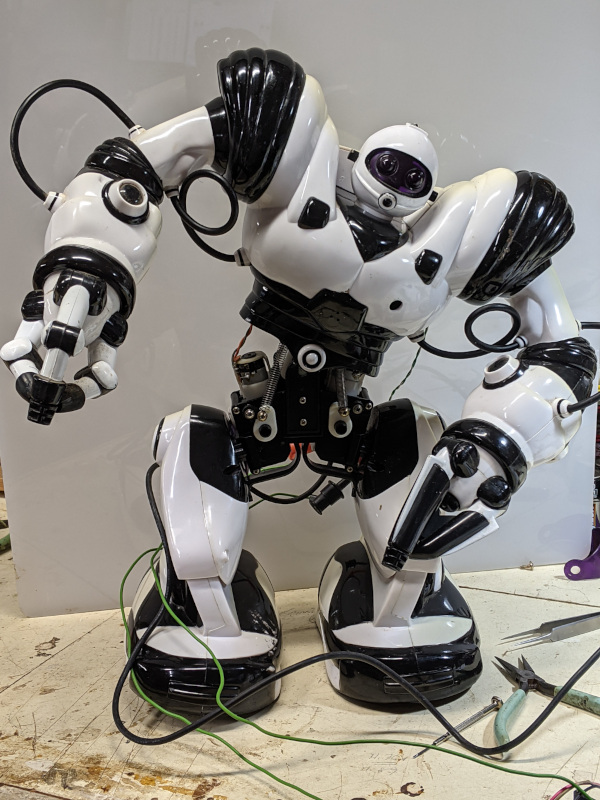

README.md

# Robosapien Redeaux

I found this Robosapien robot in a collection of old toys my kids had.  
We had some fun with this guy and I got to thinking if I could spruce him
up a bit.  With modern embedded machines and Raspery Pis with WiFi, couldn't we 
drive him through a web portal.  Maybe give it a bit of autonomy?

## Starting out

Baby steps first. I could try to control the movement directly but looking
through the old [remote control codes](src/RoboSapien Codes.md) and a fairly well matched controller, it would 
seem that a high level conroller is all that is needed.  We shall see.  I'll start
using an Arduino which is electrically easy to control and interface.  Sorry, about my pal
I left is pants off so I could monitor a repair I had to effect on his erector spinae springs.
spinal muscular surgery isn't my thing. But they seem to be holding up.  We'll see if I can get him
back into break dancing shape later.

